# Pineabble 🎯

[Visit the website](https://kichu12348.github.io/baananaa)

## Basic Details

### Team Name: Gryffindor

## Team Members:
- **Team Lead:** Neil Oommen Renni - College of Engineering Chengannur
- **Member 2:** Mahadevan Reji - College of Engineering Chengannur
- **Member 3:** Malavika GK - College of Engineering Chengannur

## Project Description

This project is a collection of quirky and pointless web experiences designed to cure boredom and provide endless, useless entertainment. It includes features that range from infinite scrolling and cat philosophy to progress bars that never quite make it to 100%.

### The Problem (that doesn't exist)

Ever feel like life is too meaningful? Are you weighed down by purpose and productivity?

### The Solution (that nobody asked for)

We’re here to lighten your existential load with a medley of pointless yet oddly satisfying pages. Whether you're seeking infinite scrolling, random philosophical insights, or want to "rate your air" based on absolutely nothing, Bananas has it all!

## Technical Details

### Technologies/Components Used

**For Software:**
- **Languages used:** JavaScript, HTML, CSS
- **Frameworks used:** React, Express (for backend)
- **Libraries used:** rollup (for bundling), .module.css(for styling)
- **Tools used:** Node.js, Git

**For Hardware:**
- Not applicable – all experiences are web-based.

### Implementation

**For Software:**

#### Installation

```bash
git clone https://github.com/kichu12348/useless_project_temp.git
cd useless_project_temp
npm install
```

#### Run

```bash
npm start
```

## Project Documentation

### Screenshots

- The Endless Scroll page with a gradually changing background and whimsical quotes.
- Philosophical Cat page, featuring a thoughtful-looking cat with an AI-generated "profound" insight.
- Pointless Progress Bars with a bar that fills up halfway before reversing, offering zero closure.

### Diagrams
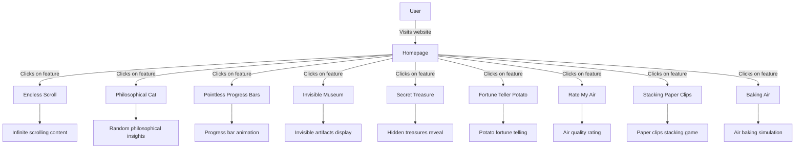

### Additional Screenshots

- **Home Page:** 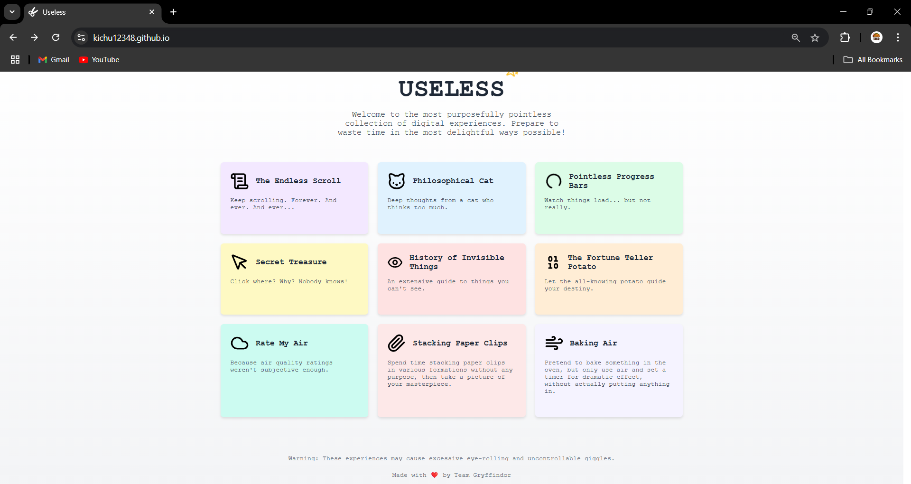
- **Endless Scroll:** 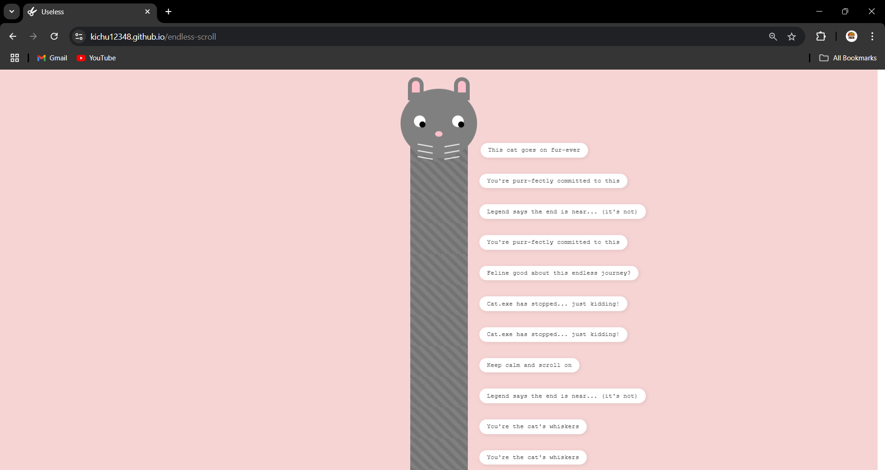
- **Philosophical Cat:** 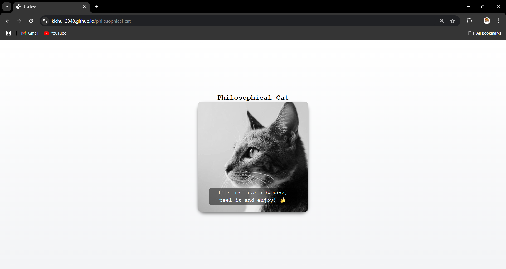
- **Pointless Progress Bars:** 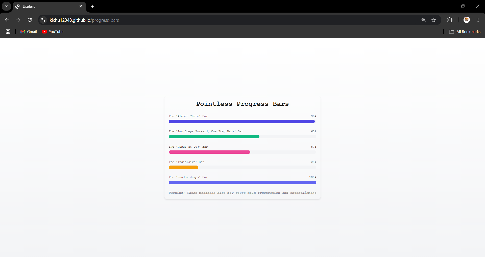
- **Secret Treasure:** 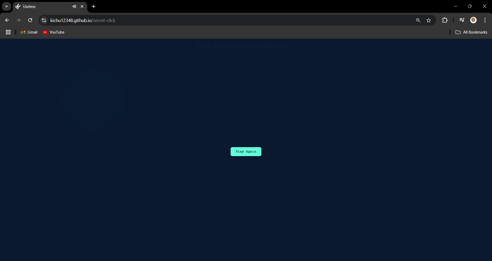
- **History of Invisible Things:** 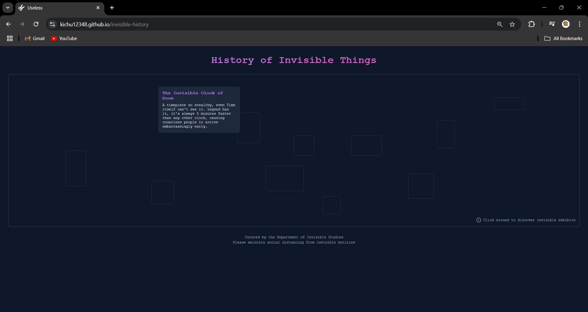
- **The Fortune Teller Potato:** 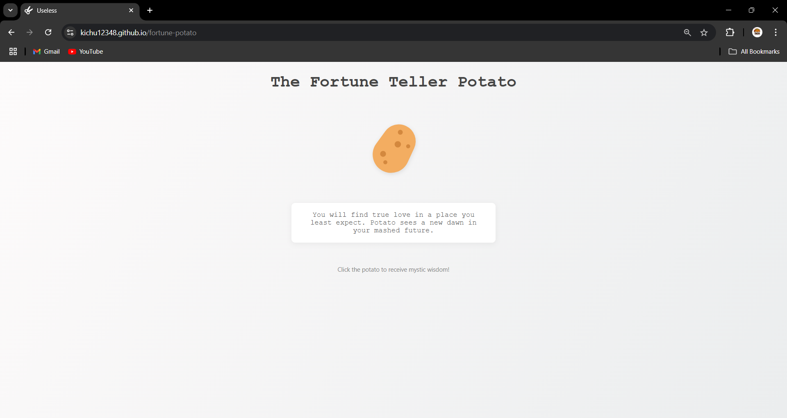
- **Rate My Air:** 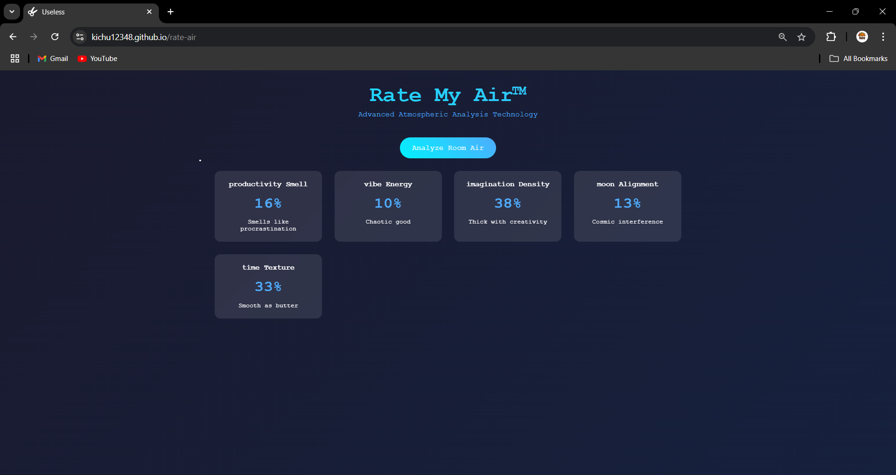
- **Stacking Paper Clips:** 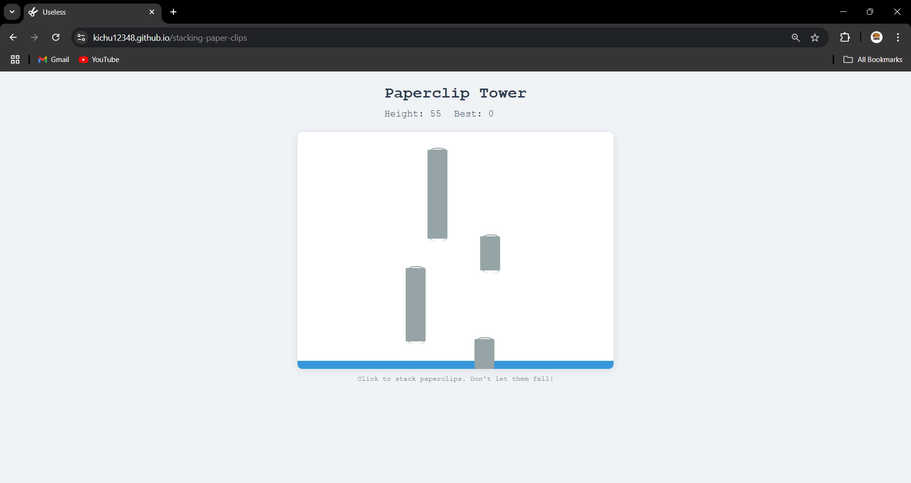
- **Baking Air:** 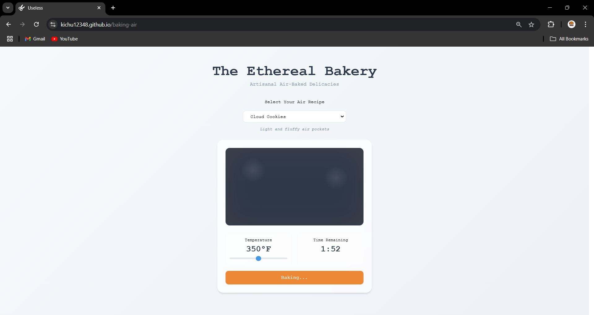

## Project Demo

**Link**
- [Demo Link](https://kichu12348.github.io/baananaa) An overview of Bananas showcasing each pointless feature.

### Additional Demos

- [Endless Scroll demo link](https://kichu12348.github.io/baananaa/endless-scroll)
- [Philosophical Cat demo link](https://kichu12348.github.io/baananaa/philosophical-cat)

## Team Contributions

- **Neil Oommen Renni:** Lead development, component structuring, implemented Endless Scroll and Rate My Air features.
- **Mahadevan Reji:** Created Pointless Progress Bars and Philosophical Cat components, assisted with styling.
- **Malavika GK:** Designed History of Invisible Things, Secret Click, and Fortune Teller Potato; added styling refinements.

Made with ❤️ at TinkerHub Useless Projects


